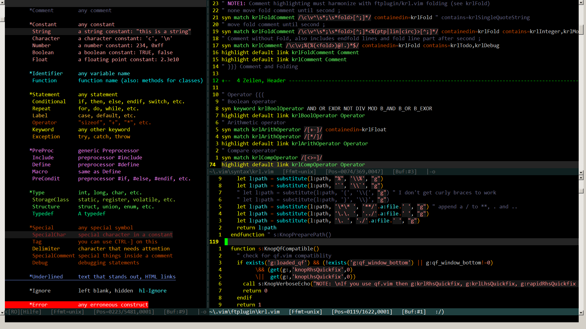
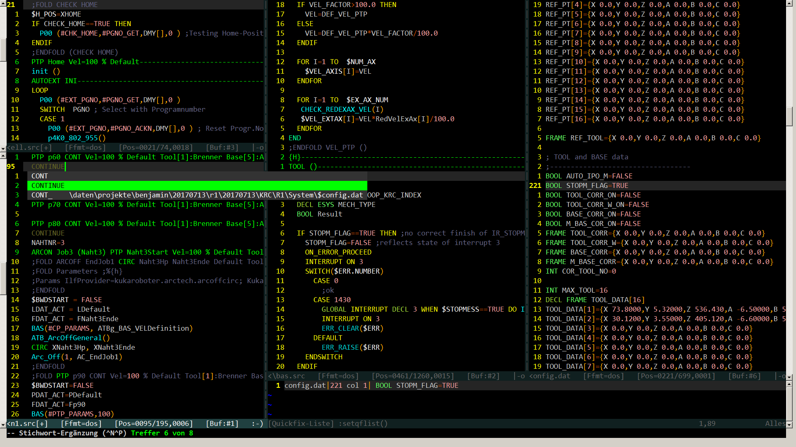

# tortus

## vim script type
color scheme
 
## description
Dark (grey and yellow on black) color scheme based on on torte.vim 
([vimscript #111][1]), motus.vim ([vimscript #1393][2]) and 
metacosm.vim ([vimscript #985][3]).  

Designed for gvim to be used with vim plugins for KRL ([vimscript #5344][4])
and Rapid ([vimscript #5348][5]). Should work fine on consoles as well.
It started as a copy of torte.vim and drifted away more and more.

tortus.vim gets quiet colorful. 
If it's too colorful for you try tortusless.vim.

tortusless.vim examples

Credits goes to Thorsten Maerz, Sergei Matusevich and Robert Melton.
 
## install details
Copy tortus.vim and tortusless.vim to `~/.vim/colors/`,  
Windows users copy it to `c:\Users\<username>\vimfiles\colors\`

Put the following lines in your .vimrc for using this color scheme:

    colorscheme tortus " or tortusless " a bit less aggressive version

If you use this colorscheme with krl.vim >=1.3.0 or rapid.vim >=1.3.0 put

    let g:krlNoHighLink=1
    let g:rapidNoHighLink=1 

in .vimrc as well.

[1]: https://www.vim.org/scripts/script.php?script_id=111
[2]: https://www.vim.org/scripts/script.php?script_id=1393
[3]: https://www.vim.org/scripts/script.php?script_id=985
[4]: https://www.vim.org/scripts/script.php?script_id=5344
[5]: https://www.vim.org/scripts/script.php?script_id=5348
